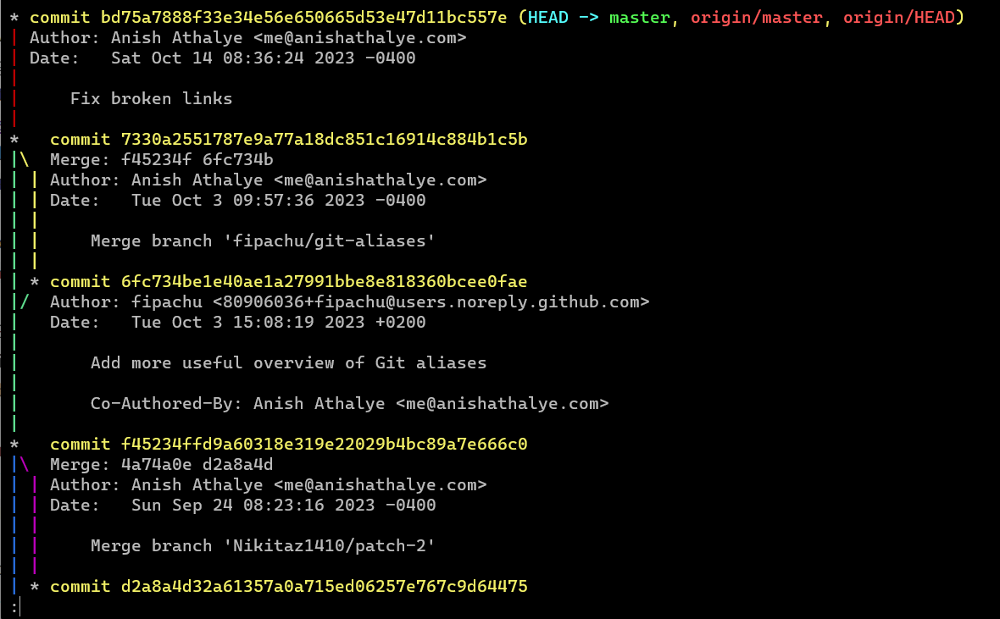
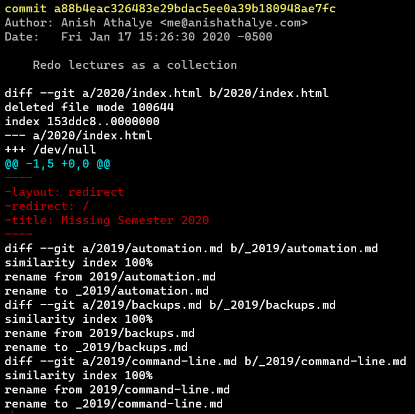

# Ex6

## 1
I have some experience with git before

## 2
### 1


### 2
Anish Athalye

### 3
```
a88b4eac (Anish Athalye 2020-01-17 15:26:30 -0500 18) collections:
```


## 3

## 4
```
➜  missing-semester git:(master) echo "newline" >> README.md
➜  missing-semester git:(master) ✗ git stash
Saved working directory and index state WIP on master: bd75a78 Fix broken links
➜  missing-semester git:(master) tail -n1 README.md
All the contents in this course, including the website source code, lecture notes, exercises, and lecture videos are licensed under Attribution-NonCommercial-ShareAlike 4.0 International [CC BY-NC-SA 4.0](https://creativecommons.org/licenses/by-nc-sa/4.0/). See [here](https://missing.csail.mit.edu/license) for more information on contributions or translations.
➜  missing-semester git:(master) git stash pop
On branch master
Your branch is up to date with 'origin/master'.

Changes not staged for commit:
  (use "git add <file>..." to update what will be committed)
  (use "git restore <file>..." to discard changes in working directory)
        modified:   README.md

no changes added to commit (use "git add" and/or "git commit -a")
Dropped refs/stash@{0} (38464978ab36d4b6247630b088c4563c11f2389e)
➜  missing-semester git:(master) ✗ tail -n1 README.md
newline
```
In what scenario might this be useful: undo by mistake

## 5

## 6

## 7
