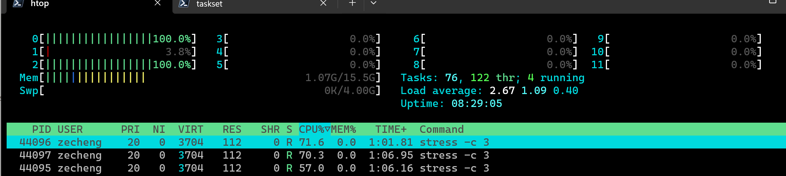

# Ex7

## Debugging

### 1
A non-exhausting list:
```
➜  ~ journalctl --since "1day ago"
Nov 06 23:52:19 SurfacePro9 kernel: Linux version 5.15.90.1-microsoft-standard-WSL2 (oe-user@oe-host) (x86_64-msft-linux-gcc>
Nov 06 23:52:19 SurfacePro9 kernel: Command line: initrd=\initrd.img WSL_ROOT_INIT=1 panic=-1 nr_cpus=12 bonding.max_bonds=0>
Nov 06 23:52:19 SurfacePro9 kernel: KERNEL supported cpus:
Nov 06 23:52:19 SurfacePro9 kernel:   Intel GenuineIntel
Nov 06 23:52:19 SurfacePro9 kernel:   AMD AuthenticAMD
Nov 06 23:52:19 SurfacePro9 kernel:   Centaur CentaurHauls
```

### 2
I don't use Python much atm.

### 3

### 4

## Profiling

## 5


## 6


## 7
```
➜  ~ lsof | grep LISTEN
python3   43514                        zecheng    3u     IPv4              82374      0t0    TCP *:4444 (LISTEN)
➜  ~ ps
    PID TTY          TIME CMD
  43520 pts/2    00:00:00 zsh
  43920 pts/2    00:00:00 ps
➜  ~ kill 43514
```

## 8

No. `taskset` launches `stress` with CPU affinity to core 0 and core 2. Even thoug there are 3 process running `stress` there, the load is distributed to those 2 CPU cores on priority, and scheduled to other CPU cores once the resource is exhausted.

## 9
